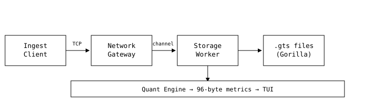
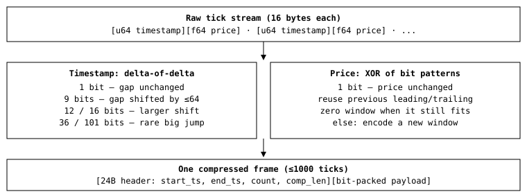
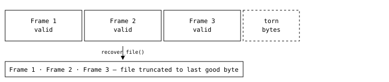

# ZeroTick

**A single-file Rust time-series database for financial ticks — TCP ingestion, Gorilla-compressed storage, real-time quant analytics, and a terminal dashboard. Zero external crates. Linux/POSIX only.**

```
cargo run -- serve   # start the database
cargo run -- ingest  # generate + send load
cargo run -- tui      # watch it live
```

---

## What it actually does

Ticks come in over TCP → get compressed and written to disk → get analyzed with a single-pass statistics engine → show up in a live terminal dashboard. That's the whole product, and every step of it is built from nothing but the Rust standard library and raw POSIX syscalls — no Tokio, no Serde, no crates.io at all.



---

## The interesting part: Gorilla-style tick compression

Storing every tick as a raw 16-byte record (`u64` timestamp + `f64` price) is simple but wasteful — timestamps barely change between ticks, and prices drift only slightly. So instead, ticks are grouped into frames of up to 1,000 and compressed bit-by-bit:

- **Timestamps** are stored as **delta-of-delta**: only the *change in the gap* between ticks is written, using a variable-length bit code (0 bits if the gap is constant, up to 65 bits for a big jump).
- **Prices** are stored as **XOR-of-previous**: XOR this price's bits against the last price's bits. If nothing changed, that's a single `0` bit. If something changed, only the "meaningful" middle bits are stored, reusing the previous window when it still fits.



On the built-in chaos test's synthetic 1,000,000-tick stream, this cuts real disk usage well below the 16 MB raw baseline — logged directly by the chaos harness at runtime as a percentage.

Reading is symmetric: a query binary-searches the frame headers for the first frame overlapping the requested time window, then decodes only those frames — never the whole file.

---

## Crash safety: frame-boundary recovery

Every frame starts with a self-describing header (`start_ts`, `end_ts`, `count`, `comp_len`). On startup — and after any failed write — the storage engine walks the file frame-by-frame, header by header. The moment a header fails validation or would run past the end of the file, that's the true end of good data. Everything after gets truncated.



This is exercised automatically: `cargo run -- chaos` writes 1,000,000 real ticks, appends 11 garbage bytes to fake a torn write mid-frame, runs recovery, then re-runs the full quant query over the healed file and checks the tick count and stats still come out right.

**Honest limitation:** live queries read the in-memory accumulator, not the file, while a symbol is actively receiving traffic, so cold-file reads and hot in-flight writes aren't linearizable against each other — a query mid-write may not observe the newest bytes yet. That's a documented trade-off, not a bug.

---

## Single-pass quant engine

Every metric — count, OHLC, mean, variance, std-dev, z-score, Bollinger bands, max drawdown — comes from one accumulator that touches each tick exactly once and holds only a fixed handful of running scalars (72 bytes), no matter whether it's seen 10 ticks or 10 million:

- **Variance** uses **Welford's online algorithm** — no second pass over the data, no numerically unstable "sum of squares".
- **Max drawdown** tracks running peak price vs. current price on the fly.
- The whole thing benchmarks at multiple millions of ticks/sec on a single core (`cargo run -- bench`).

---

## Engineering problems we actually had to solve

| Problem | Fix |
|---|---|
| One `read()` syscall per byte in the bit writer | Own the `Vec<u8>` directly, use amortized `push` |
| A fresh heap allocation per frame on every query | One reusable buffer, `resize()` instead of re-allocating |
| Two raw `read_exact` syscalls per batch header at high TPS | Wrap the socket in an 8 KB `BufReader` |
| A global `Mutex<HashMap<...>>` serializing every symbol's ingest | Swapped for `RwLock`: existing symbols take a cheap read lock |
| `fsync` on every single batch stalling the storage worker at 250k ticks/sec | Size-based `sync_data()` — only forced to disk every 256 KB |
| Branchy min/max in the hot accumulator loop | Branchless `f64::max` / `f64::min` |

---

## Zero-dependency, by construction, not by promise

- `Cargo.toml` has **no dependencies section at all** — not even a dev-dependency.
- Every "crate you'd normally reach for" is a stdlib substitute instead:
  - `itoa` → `core::fmt::NumBuffer` (Rust 1.98) for allocation-free integer formatting in the TUI
  - `byteorder` → `u64::from_le_bytes` / `to_le_bytes`
  - `clap` → manual `std::env::args()` routing
  - `crossbeam-channel` → `std::sync::mpsc::sync_channel`
  - `rand` → a small custom LCG in the load generator
- The whole engine — protocol, compression, storage, quant math, network gateway, ingest client, TUI, chaos harness, benchmark — lives in **one `main.rs`**, split into clearly named modules rather than files.
- **Target OS: Linux / macOS / WSL.** The storage layer uses `std::os::unix::fs::FileExt::read_at` for lock-free positional reads, which doesn't exist on Windows. Run it under WSL or a Linux container there.

---

## Requirements

- **Rust toolchain:** Requires Rust 1.98 or higher. The engine explicitly relies on `core::fmt::NumBuffer` to achieve zero-allocation integer formatting in the terminal UI without using the `itoa` crate. Earlier compiler versions will fail to resolve this module.
- **Operating system:** Requires Linux or a POSIX-compliant Unix system (such as macOS). The storage engine's lock-free concurrency model depends on `std::os::unix::fs::FileExt::read_at` to map queries directly to absolute disk byte offsets. Compiling on native Windows will throw an unresolved import error.
- **External dependencies:** Absolute zero. The `Cargo.toml` `[dependencies]` block must remain completely empty to satisfy the project's foundational constraints.

## Command reference

```text
cargo run -- serve   [port] [data_dir]                              # start the server
cargo run -- ingest  [symbol/ALL/csv] [host] [port] [tps] [max]      # generate load
cargo run -- tui     [symbol] [host] [port]                          # live dashboard
cargo run -- chaos   [data_dir]                                      # torn-write recovery proof
cargo run -- bench                                                   # quant engine throughput
```

## Current scope

TCP ingestion · Gorilla-compressed persistent storage · frame-boundary crash recovery · single-pass Welford statistics · OHLC/volatility/drawdown metrics · TrueColor terminal dashboard · automated chaos verification · zero third-party crates.
